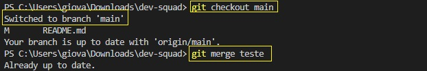

<div style="text-align: center;">


<h1>Repositório para prática de trabalho em equipe</h1>
</div>


## Descrição
Por meio deste repositório você poderá praticar o trabalho colaborativo e conhecimentos de versionamento de código com o Git e GitHub.


## Pré-Requisitos

* Ter perfil no GitHub
* Ter o Git instalado - caso não tenha, baixe por meio do link a seguir: [Baixar Git](https://git-scm.com/downloads)
* Ter uma IDE para edição de código, como o Visual Studio Code: [Baixar VS Code](https://code.visualstudio.com/download)


## Orientações

### Git

#### Configuração inicial (Git)
> Essa é a primeira coisa que você deve fazer ao instalar o git: Configurar o nome de usuário e e-mail. 
> Este procedimento só precisa ser realizado **uma vez**

```bash
git config --global user.name "Seu nome Aqui"
```

```bash
git config --global user.email seuemail@exemplo.br
```

### Clonando o repositório (GitHub)

1. Na sua máquina, crie uma pasta para salvar o projeto;

2. Copie o link do repositório para cloná-lo (siga os passos abaixo);


3. Clique com o **botão direito** do mouse na pasta que você criou no passo 1, e escolha a opção **abrir no terminal** OU **Git Bash Here**;

4. Com o **terminal aberto**, digite o código:
```bash 
git clone linKCopiado-No-Passo-2
```


**!ATENÇÃO**: Caso você esteja realizando esse procedimento pela primeira vez, será necessário realizar o login no GitHub. **Durante o processo de clonagem aparecerá a opção para você realizar o login**, escolha a opção de **logar pelo navegador**. Será aberta uma janela como mostra na imagem abaixo: Preencha as informações para concluir o processo.
> Este procedimento só precisa ser realizado **uma vez**


5. Pronto! Agora **verifique se o repositório já encontra-se na pasta que você configurou para salvá-lo e já pode começar a mexer no projeto**.


### Comandos essenciais (Git)
> **OBS_1**: Todo comando inicia com a palavra git.


**OBS_2**: Quando trabalhamos em equipe é muito importante atualizarmos o nosso repositório local SEMPRE antes de iniciar novos trabalhos, para tanto utilize o comando abaixo **SEMPRE** antes de começar a mexer no código. Isso manterá o projeto atualizado na sua máquina.

```bash
git pull
```


**Sempre que você alterar um arquivo e quiser subí-lo para o GitHub, você deverá ser os comandos abaixo**:

1. Indica em **vermelho** - quais arquivos foram editados - e, em **verde** - os arquivos adicionados para serem comitados:

```bash
git status
```

2. Adiciona **UM** arquivo ou **TODOS** os arquivos editados, para serem comitados, respectivamente.

```bash
git add nomeArquivo.extensão
```

```bash
git add .
```

3. Salva o(s) arquivo(s) editado(s) adicionando uma mensagem. Ex.: Desenvolvimento de formulário, correção de bug 'x'...
```bash
git commit -m "mensagem"
```

4. Envia os arquivo da **sua** máquina para o **GitHub**

```bash
git push origin main
```


### Comandos - trabalho em equipe
Ao criar um projeto e versioná-lo, por padrão é criado uma **branch** chamada de **main** que é a **principal** - onde está a aplicação. Porém, **quando trabalhamos em equipe há a necessidade de criarmos outras branchs** para **evitar bugs na aplicação salva na branch main**. Veja abaixo os comandos que podem ser utilizados e quando usá-los:


1. Exibe uma lista com todas as branchs do projeto/repositório

```bash
git branch
```


<br/>

2. Cria nova branch
> Ao criar uma nova branch você estará levando para ela uma **cópia da versão do projeto** que está na **branch main**.

```bash
git branch nomeBranch
```
> No exemplo abaixo foi criada uma nova branch com o nome **teste** e, em seguida, o **comando para listar as branchs** foi executado. Veja que agora a **branch teste é exibida na lista**.


<br/>

3. Trocando de branch
> Observe que a branch selecionada fica com um * (asterisco) e com o **nome na cor verde**.


```bash
git checkout nomeBranch
```


<br/>

4. Enviando a branch para o repositório remoto (GitHub)

- **git push**: ato de enviar as alterações
- **-u**: Complemento do comando
- **origin**: Destino
- **nomeBranch**: Qual branch será enviado do repositório local para o remoto

```bash
git push origin nomeBranch
```
Ou

```bash
git push -u origin nomeBranch
```

<br/>

4. Excluindo uma branch do repositório remoto (GitHub)

> Observe que há apenas **UMA diferença** entre o enviar e o excluir. Ao **excluir a branch** são utilizados : (dois pontos) **antes do nome da branch a ser excluída**, enquanto **no enviar branch não tem os pontos** (cuidado para não confundir).

```bash
git push origin :nomeBranch
```

<br/>

5. Junta/Une branchs.
> Esse procedimento costuma ser realizado para juntar/trazer o código de outra branch para a main.

Ex.: Traz todas as alterações da branch especificada para a **main** - ela precisa estar selecionada.

```bash
git merge nomeBranch
```




<br/>

6. Excluindo uma branch do repositório local (sua máquina)

> **OBS**: A branch que você quer excluir não pode estar selecionada.

```bash
git branch -D nomeBranch
```

